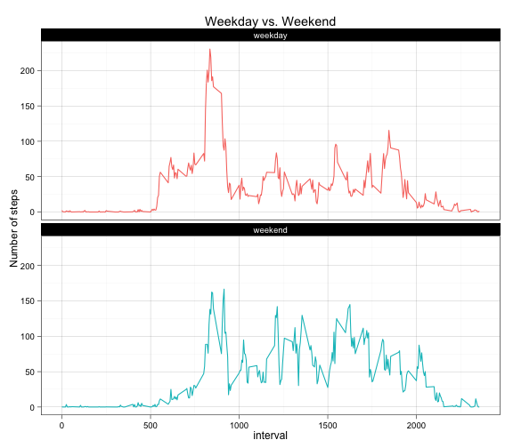

Peer Assessment 1
=================

_This is an R Markdown document for peer assessment 1 of reproducible research._

## Loading and preprocessing the data

```r
unzip('activity.zip')
act <- read.csv('activity.csv')
str(act)
```

```
## 'data.frame':	17568 obs. of  3 variables:
##  $ steps   : int  NA NA NA NA NA NA NA NA NA NA ...
##  $ date    : Factor w/ 61 levels "2012-10-01","2012-10-02",..: 1 1 1 1 1 1 1 1 1 1 ...
##  $ interval: int  0 5 10 15 20 25 30 35 40 45 ...
```


## What is mean total number of steps taken per day?
### 1. Total number of steps taken per day

```r
step <- tapply(act$step, act$date, sum)
barplot(step, main = "Steps taken per day by barplot", xlab = 'date', ylab = 'steps')
```

 

### 2. Make a histogram of the total number of steps taken each day
- A histogram try to use the a series of ranges in the steps per day and represent the distribution of steps in a specific range in a statistical manner (frequency, density or others).
- A barplot simply summarizes the steps on each day for comparison.


```r
hist(step, col = 'gray', xlab = 'steps')
```

 

### 3. Mean and mediean of the total number of steps per day

```r
mean(step, na.rm = T) ## For mean value
```

```
## [1] 10766.19
```

```r
median(step, na.rm = T) ## For median value
```

```
## [1] 10765
```

## What is the average daily activity pattern?
### 1. Make a time series plot

```r
library(dplyr, warn.conflicts = FALSE)
act <- tbl_df(act)
a_stp <- act %>%
    group_by(interval) %>%
    summarize(mean = mean(steps, na.rm = T))
plot(a_stp$interval, a_stp$mean, type = 'l', xlab = 'interval', ylab = 'average steps', main = 'average steps of 5 min interval')
```

 

### 2. Maximum number of steps in 5 min interval

```r
a_stp[which.max(a_stp$mean),]
```

```
## Source: local data frame [1 x 2]
## 
##   interval     mean
## 1      835 206.1698
```

## Imputing missing values
### 1. Total number of rows with NAs

```r
sum(is.na(act$steps))
```

```
## [1] 2304
```

### 2. Filling gaps (using the mean for each 5-minute interval)

```r
n <- length(levels(act$date))
na_idx <- is.na(act$steps); mean_5 <- rep(a_stp$mean, n)
mean_5[!na_idx] <- 0; act$steps[na_idx] <- 0
act$steps <- act$steps + mean_5
head(act)
```

```
## Source: local data frame [6 x 3]
## 
##       steps       date interval
## 1 1.7169811 2012-10-01        0
## 2 0.3396226 2012-10-01        5
## 3 0.1320755 2012-10-01       10
## 4 0.1509434 2012-10-01       15
## 5 0.0754717 2012-10-01       20
## 6 2.0943396 2012-10-01       25
```

### 3. New dataset

```r
act_new <- act
```

### 4. New histogram, mean and median
Imputing missing data does not change the mean of total steps, but reduces the median value. Also, They become the same value in the end.

```r
t_step <- act_new %>%
    group_by(date) %>%
    summarize(sum = sum(steps))
hist(t_step$sum, col = 'blue', xlab = 'steps', main = 'Histogram of total steps')
```

 

```r
mean(t_step$sum)
```

```
## [1] 10766.19
```

```r
median(t_step$sum)
```

```
## [1] 10766.19
```

## Are there differences in activity patterns between weekdays and weekends?
### 1. New factor variable (weekday)

```r
act_new <- mutate(act_new, week = weekdays(as.Date(act_new$date)))
act_new$week <- as.factor(ifelse(act_new$week %in% c('Saturday', 'Sunday'), 'weekend', 'weekday'))
head(act_new)
```

```
## Source: local data frame [6 x 4]
## 
##       steps       date interval    week
## 1 1.7169811 2012-10-01        0 weekday
## 2 0.3396226 2012-10-01        5 weekday
## 3 0.1320755 2012-10-01       10 weekday
## 4 0.1509434 2012-10-01       15 weekday
## 5 0.0754717 2012-10-01       20 weekday
## 6 2.0943396 2012-10-01       25 weekday
```

### 2. Make a panel plot (time series grouped by weekday and weekend)

```r
library(ggplot2)
step_w <- act_new %>%
    group_by(interval, week) %>%
    summarize(mean = mean(steps))

ggplot(step_w, aes(x = interval, y = mean)) + geom_line(aes(color = week)) + facet_wrap(~week, ncol = 1) + labs(x = 'interval', y = 'Number of steps') + ggtitle('Weekday vs. Weekend') + theme_linedraw() + theme(legend.position = 'none');
```

 


